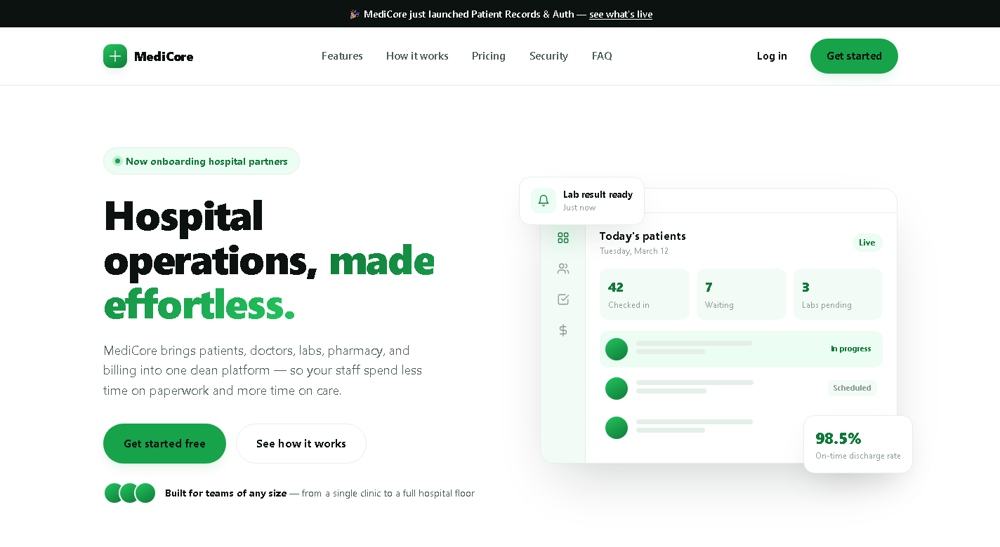

<div align="center">

# 🏥 MediCore — Enterprise Healthcare Platform

**A production-style hospital operations platform** — patients, doctors, labs, pharmacy, and billing on one system — built the way a real engineering team ships software: requirements first, architecture on paper, tests and CI/CD from day one.

[](https://github.com/Mugabo-art/enterprise-healthcare-platform/actions/workflows/ci-cd.yml)
[](LICENSE)
[](https://openjdk.org/)
[](https://spring.io/projects/spring-boot)
[](https://react.dev/)
[](https://www.postgresql.org/)
[](docker-compose.yml)

[Quick start](#-quick-start) · [Modules](#-modules) · [Architecture](#-architecture--docs) · [Tech stack](#-tech-stack) · [Testing](#-testing)

</div>

<br>

<p align="center">
  
</p>

---

## What it is

MediCore manages the day-to-day operational workflow of a hospital or clinic: patient records, doctor scheduling, prescriptions, lab requests/results, pharmacy inventory, billing, and role-based dashboards. It's built as a portfolio flagship — the emphasis is on doing the *boring, real-engineering parts* properly: an explicit architecture and threat model, a schema designed before code, containerized services, observability, and a deployment path to a real Kubernetes cluster.

## ✅ Status: what's real vs. what's scaffolded

Honesty over hype — here's what actually works today:

| Area | Status |
|---|---|
| **Auth** (register, login, JWT + refresh tokens, role-based access) | ✅ Working end-to-end |
| **Patient records** (search, view) | ✅ Working end-to-end (DB → API → UI) |
| **Doctor module** (schedule view, prescriptions, visit diagnosis/status) | ✅ Working end-to-end (API; no UI yet) |
| **Analytics dashboard** (KPI tiles, visit trend, status/type breakdowns, role-scoped) | ✅ Working end-to-end (DB → API → UI) |
| **Patient self-service portal** (a PATIENT-role account, once linked by staff, reads its own record only) | ✅ Working end-to-end (DB → API → UI) |
| **Lab workflow** (test requests against a visit, results, status tracking) | ✅ Working end-to-end (DB → API → UI) |
| **Pharmacy** (medication inventory, low-stock alerts, dispensing against prescriptions) | ✅ Working end-to-end (DB → API → UI) |
| Billing | 🚧 Scaffolded / planned — see [`docs/ARCHITECTURE.md`](docs/ARCHITECTURE.md) for module boundaries |
| Observability (Prometheus + Grafana), containerized infra (Postgres, Redis, Kafka) | ✅ Running via Docker Compose |
| Kubernetes manifests | ✅ Present in [`k8s/`](k8s/) — kustomize, HPA, PDB, NetworkPolicies, non-root/read-only pods, nightly DB backup job |
| **Production hardening** (fail-fast secrets validation, no seeded accounts, admin-only staff creation, audit trail, rate limiting, security headers, signed MFA challenge, refresh-token reuse detection, JSON logs + request ids, image scanning) | ✅ See [`docs/DEPLOYMENT_GUIDE.md`](docs/DEPLOYMENT_GUIDE.md#production-configuration) |

## 🧩 Modules

| Module | Includes |
|---|---|
| Authentication | Login, registration, JWT, refresh tokens, MFA hook |
| Patient Management | Patient records, medical history, visits, attachments |
| Doctor Module | Scheduling, prescriptions, diagnosis, notes |
| Laboratory | Test requests, results, reports |
| Pharmacy | Inventory, stock, dispensing |
| Billing | Payments, invoices, reports |
| Analytics | Dashboards, statistics, hospital KPIs |
| Notifications | Email, SMS, push |
| AI | Medical summarization, appointment assistant |

## 🛠 Tech stack

**Frontend** — React 18 · React Router · Vite · Vitest
**Backend** — Spring Boot 3 · Spring Security · Spring Data JPA · Flyway · JJWT
**Data & messaging** — PostgreSQL 16 · Redis 7 · Kafka
**Infra & ops** — Docker Compose · Kubernetes · Prometheus · Grafana · GitHub Actions

## 🚀 Quick start

### Docker (recommended)

```bash
git clone https://github.com/Mugabo-art/enterprise-healthcare-platform.git
cd enterprise-healthcare-platform
cp .env.example .env
docker compose up --build
```

| Service | URL |
|---|---|
| Frontend | http://localhost:5173 |
| Backend API | http://localhost:8080/api |
| Swagger UI | http://localhost:8080/swagger-ui.html |
| Postgres | localhost:5432 (`healthplatform` / see `.env`) |
| Redis | localhost:6379 |
| Prometheus | http://localhost:9090 |
| Grafana | http://localhost:3001 (`admin` / `admin` on first run) |

**Dev login:** `admin@hospital.test` / `Password123!` (seeded automatically — see [`V2__seed_dev_admin.sql`](backend/src/main/resources/db/migration/V2__seed_dev_admin.sql)), or register a new account from the app.

### Backend only, no Docker

```bash
cd backend
mvn spring-boot:run
```
Requires a local PostgreSQL and Redis instance — see `backend/src/main/resources/application.yml`.

### Frontend only

```bash
cd frontend
npm install
npm run dev
```

## 📐 Architecture & docs

| Doc | Purpose |
|---|---|
| [SRS.md](docs/SRS.md) | Functional & non-functional requirements |
| [ARCHITECTURE.md](docs/ARCHITECTURE.md) | System design, components, data flow, trade-offs |
| [DATABASE_DESIGN.md](docs/DATABASE_DESIGN.md) | Schema, normalization, indexing strategy |
| [ER_DIAGRAM.md](docs/ER_DIAGRAM.md) | Entity-relationship diagram |
| [UML_DIAGRAMS.md](docs/UML_DIAGRAMS.md) | Class & sequence diagrams |
| [API_DOCUMENTATION.md](docs/API_DOCUMENTATION.md) / [openapi.yaml](docs/openapi.yaml) | Endpoints, request/response shapes, auth |
| [THREAT_MODEL.md](docs/THREAT_MODEL.md) | STRIDE-based threat model |
| [DEPLOYMENT_GUIDE.md](docs/DEPLOYMENT_GUIDE.md) | Laptop → cloud VM → Kubernetes |

## 🧪 Testing

```bash
cd backend && mvn test
cd frontend && npm test
```

## ⚙️ CI/CD

Every push and PR to `main` runs lint, build, and test for both backend and frontend via GitHub Actions ([`.github/workflows/ci-cd.yml`](.github/workflows/ci-cd.yml)). See [DEPLOYMENT_GUIDE.md](docs/DEPLOYMENT_GUIDE.md) for how the pipeline extends to a deploy stage via ArgoCD.

## 🤝 Contributing

See [CONTRIBUTING.md](CONTRIBUTING.md) for branching, commit style, and how docs stay in sync with code. Open work lives in [Issues](../../issues) and [Milestones](../../milestones).

## 📄 License

MIT — see [LICENSE](LICENSE).
