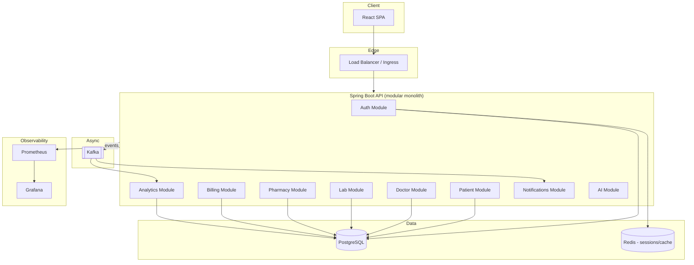
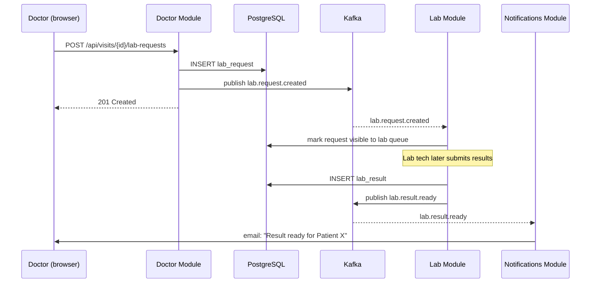

# Architecture Document
## Enterprise Healthcare Platform

## 1. Architectural Style

EHP is designed as a **modular monolith that is decomposition-ready**: v1 ships as a single Spring Boot application with strict package-per-module boundaries (`auth`, `patient`, `doctor`, `lab`, `pharmacy`, `billing`, `analytics`, `notifications`, `ai`), each with its own controller/service/repository/model layers and no cross-module repository access. This lets the project demonstrate microservices *thinking* — clear bounded contexts, async communication via Kafka for cross-module events — without paying the operational cost of running 9 separate services for a portfolio project on day one.

**Why not microservices from the start?** Splitting too early adds deployment and network complexity that would dwarf the actual business logic at this scale. The module boundaries are drawn so that any module (e.g. `pharmacy`) can be extracted into its own Spring Boot service later with minimal rework — its only external communication is already via its service interface and Kafka events, never direct DB access into another module's tables.

## 2. High-Level Components

## 3. Component Responsibilities

| Component | Responsibility |
|---|---|
| React SPA | Role-aware UI; talks only to the API, never directly to the DB |
| Auth Module | Issues/validates JWTs, manages refresh tokens in Redis, enforces RBAC via Spring Security filters |
| Patient / Doctor / Lab / Pharmacy / Billing | Domain modules; each owns its own tables and publishes domain events (e.g. `lab.result.ready`) |
| Kafka | Decouples "something happened" from "who needs to react" — e.g. a lab result triggers a notification *and* an analytics update without those modules being coupled to the lab module's code |
| Redis | Refresh-token store and hot-path caching (e.g. dashboard KPI cache with short TTL) |
| Prometheus/Grafana | Metrics scraped from Spring Boot Actuator; dashboards for latency, error rate, queue lag |

## 4. Key Design Decisions & Trade-offs

| Decision | Trade-off accepted |
|---|---|
| Modular monolith over microservices for v1 | Simpler ops and deployment; accepts that the whole app scales/deploys as one unit until a module is extracted |
| JWT (stateless) over server-side sessions | Scales horizontally with no sticky sessions; accepts the added complexity of refresh-token rotation and revocation via Redis |
| Kafka for cross-module events, not for the request/response API path | Adds an infra dependency; in exchange, modules stay decoupled and new consumers (e.g. a future audit-log service) can subscribe without touching existing code |
| PostgreSQL for all modules (not polyglot persistence) | Simpler to operate and to reason about transactions/joins; accepted because none of the v1 modules need a fundamentally different data model (no graph/time-series requirement yet) |
| AI module calls an external LLM API rather than hosting a model | Avoids GPU infra entirely; accepts external API latency/cost and requires the advisory-only labeling in FR-9.3 |

## 5. Request Flow Example — "Doctor orders a lab test"

## 6. Deployment Topology

See [DEPLOYMENT_GUIDE.md](DEPLOYMENT_GUIDE.md) for the full path; in short: Docker Compose for local dev → Kubernetes (via manifests in `/k8s`) for a real cluster → ArgoCD watching the repo for GitOps-style continuous deployment → Prometheus/Grafana for observability of the running cluster.
