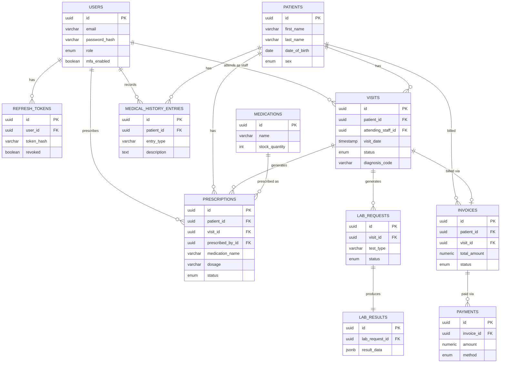

# Entity-Relationship Diagram
## Enterprise Healthcare Platform (v1 scope)

Rendered version: GitHub renders Mermaid natively in Markdown previews. See [DATABASE_DESIGN.md](DATABASE_DESIGN.md) for column-level detail and indexing strategy.
