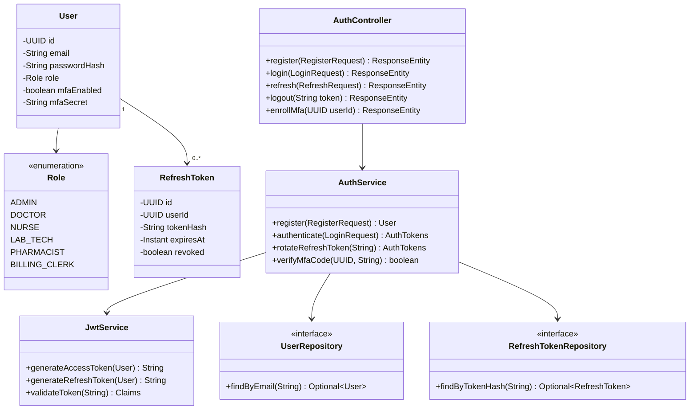
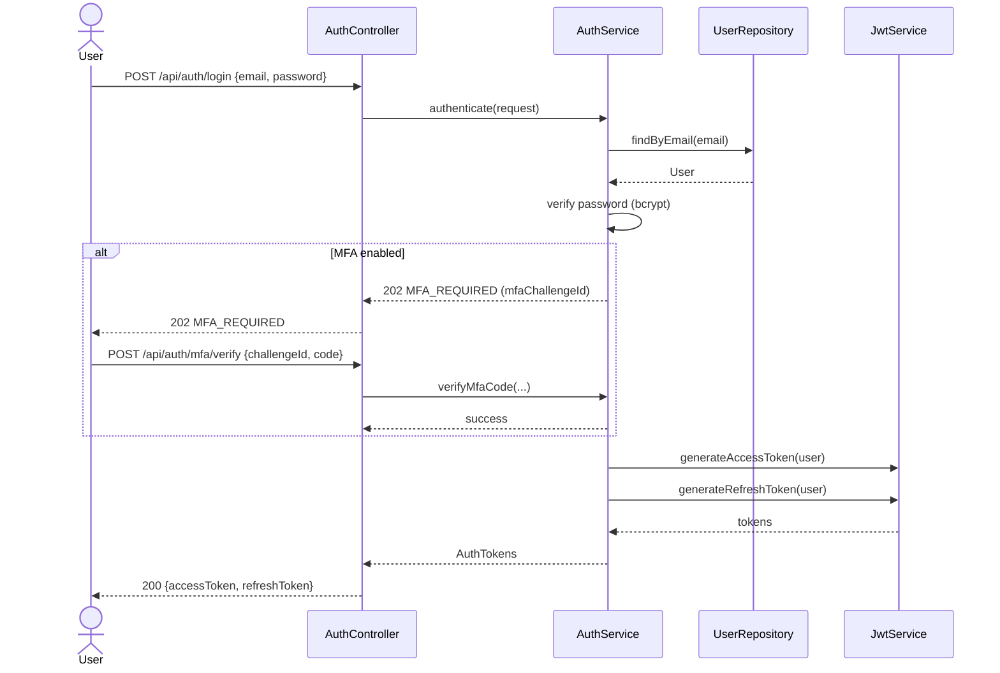
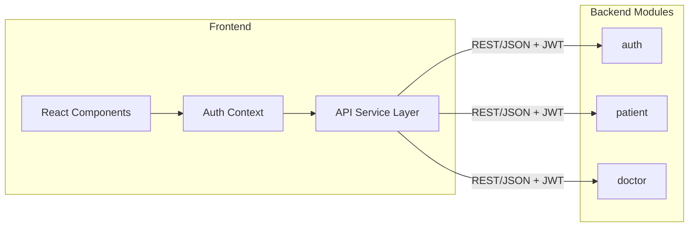

# UML Diagrams
## Enterprise Healthcare Platform

## 1. Class Diagram — Auth Module

## 2. Sequence Diagram — Login with MFA

## 3. Component Diagram

See [ARCHITECTURE.md](ARCHITECTURE.md) for the system-level component diagram and [ER_DIAGRAM.md](ER_DIAGRAM.md) for the data model.
